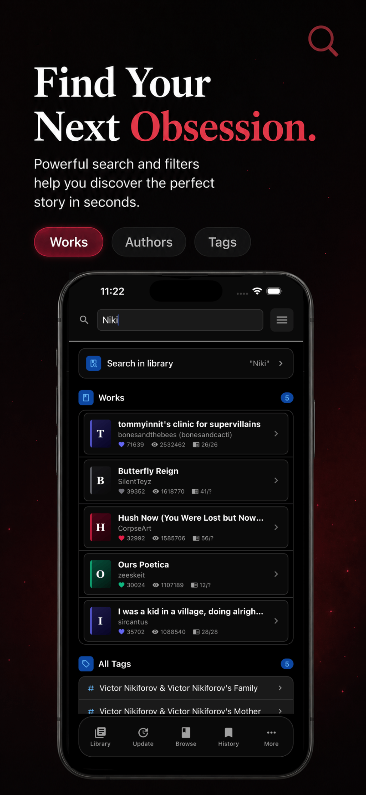
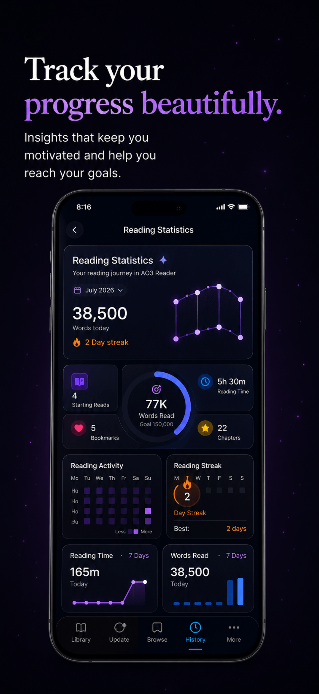

# AO3 Reader – Unofficial Archive of Our Own App for iPhone & Android

The **AO3 Reader** is an unofficial **Archive of Our Own (AO3)** reader app designed for **iPhone** and **Android**. Read your favorite fanfiction with a beautiful, modern reading experience featuring **offline reading**, **bookmarks**, **collections**, **custom themes**, **reading statistics**, **downloaded works**, and much more.

Whether you're reading romance, fantasy, anime fanfiction, Harry Potter, Marvel, DC, BTS, or any other Archive of Our Own stories, AO3 Reader provides a clean, distraction-free experience built specifically for AO3 readers.

---

# 📱 Download

## 🍎 App Store

https://apps.apple.com/us/app/ao3-archive-reader-unofficial/id6772581092

## 🤖 Google Play

https://play.google.com/store/apps/details?id=com.gpllc.ao3reader.app

---

# ✨ Features

- 📚 Read Archive of Our Own (AO3) works
- ❤️ Save unlimited bookmarks
- 📥 Download stories for offline reading
- 🌙 Beautiful Dark Mode
- 🎨 Multiple reading themes
- 🔤 Adjustable fonts and text size
- 📖 Continue reading from where you left off
- 📂 Organize your library with collections
- 📊 Reading statistics and achievements
- 🔎 Powerful search
- ⭐ Favorite works
- ☁️ iCloud Sync (iOS)
- 🌍 Multi-language support
- 🚀 Fast and lightweight
- 🔒 Privacy-focused

---

# Why AO3 Reader?

AO3 Reader was created to provide the best possible reading experience for Archive of Our Own users.

Instead of reading in a browser, AO3 Reader offers a native mobile experience with premium typography, customizable layouts, offline access, and powerful organization tools.

Perfect for readers who enjoy:

- Fanfiction
- AO3 Stories
- Archive of Our Own
- Fanfic Reading
- Offline Books
- Reading Novels
- Fiction Library
- Ebooks
- Digital Reading

---

# Perfect For Reading

- Harry Potter Fanfiction
- Marvel Fanfiction
- DC Fanfiction
- Star Wars
- BTS Fanfiction
- Anime Fanfiction
- Romance
- Fantasy
- Sci-Fi
- LGBTQ+ Stories
- Original Works

and every story available on Archive of Our Own (AO3).

---

# Screenshots

<h2 align="center">App Screenshots</h2>

  
  
  

  
  

---

# Frequently Asked Questions

## Is this the official AO3 app?

No.

AO3 Reader is an **unofficial Archive of Our Own reader** created by an independent developer to improve the mobile reading experience.

## Can I read AO3 offline?

Yes.

Downloaded works can be read without an internet connection.

## Does it support bookmarks?

Yes.

Bookmarks are synchronized and easy to manage.

## Can I customize the reader?

Yes.

Choose different fonts, themes, spacing, and layouts for a comfortable reading experience.

---

# Keywords

AO3, Archive of Our Own, AO3 Reader, AO3 App, Archive Reader, Fanfiction Reader, Fanfic Reader, Offline Reader, Reading App, iPhone Reader, Android Reader, Fiction Reader, Ebook Reader, Story Reader, Archive of Our Own App, AO3 Mobile App, Fanfiction App, Download AO3 Stories, Offline Fanfiction, AO3 Bookmarks, AO3 Collections, Reading Statistics, Reading Tracker, Reading Themes, Dark Mode Reader.

---

# Disclaimer

AO3 Reader is an unofficial application and is not affiliated with, endorsed by, or sponsored by the Organization for Transformative Works (OTW) or Archive of Our Own (AO3).

All trademarks belong to their respective owners.

---

# Links

🍎 App Store

https://apps.apple.com/us/app/ao3-archive-reader-unofficial/id6772581092

🤖 Google Play

https://play.google.com/store/apps/details?id=com.gpllc.ao3reader.app

⭐ If you enjoy AO3 Reader, consider starring this repository.
